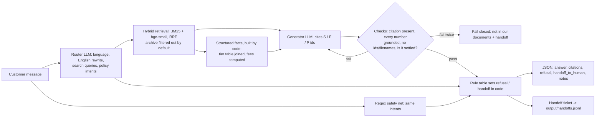

# RiverPay Customer Assistant

A question-answering assistant over the RiverPay knowledge pack. It answers only from the handbook, cites a real
document and section for every fact, uses the current fee schedule rather than the archived one, refuses what the
policy forbids, and hands off to a human when it should.

| 16 required questions × 3 runs (held out) | This system            | Mega-prompt baseline (same model) |
| ------------------------------------------ | ---------------------- | --------------------------------- |
| Answers passing every check                | **48/48 (100%)** | 39/48 (81%)                       |
| Correct refusal / handoff behaviour        | 100%                   | 88%                               |
| Citations pointing to a real doc + section | 100%                   | 94%                               |
| Cost / latency per question                | $0.002 · p50 1.9 s    | $0.0017 · p50 0.8 s              |

Our own 36-question dev set, 3 runs: **108/108**. Full tables: [output/eval_scorecard.md](output/eval_scorecard.md),
[output/dev_scorecard.md](output/dev_scorecard.md). Graded answers: [output/eval_results.json](output/eval_results.json).

## Run it (8 commands)

```powershell
cd riverpay-assistant
python -m venv .venv
.venv\Scripts\activate                     # macOS/Linux: source .venv/bin/activate
pip install torch --index-url https://download.pytorch.org/whl/cpu
pip install -r requirements.txt
copy .env.example .env                     # then paste GROQ_API_KEY=... (console.groq.com)
python run_eval.py --runs 3 --baseline     # -> output/eval_results.json + eval_scorecard.md
python cli.py                              # chat; or: streamlit run streamlit_app.py
```

Docker: `docker compose up --build` opens the web chat at http://localhost:8501. The key is injected from `.env` at
run time and never copied into the image. Offline tests with no API key: `python -m unittest discover tests`.
Citation checker (stretch goal): `python check_citations.py`.

## How it works



**Real:** parsing, retrieval, both LLM calls (Groq `llama-3.3-70b-versatile`), facts, rules, checks, citations, eval.
**Mocked:** human handoff. It appends a ticket to `output/handoffs.jsonl` and doesn't connect to a CRM. There is no
accoun

saction status and loan decisions are never looked up.

**Parsing** ([app/ingest.py](app/ingest.py)). The pack is read verbatim from the Notion export in `data/pack/` and
parsed with a CommonMark parser (markdown-it), not with regexes over raw text. Every section keeps its structure:
list items, numbered steps, paragraphs, `**Key:** value` metadata and `<aside>` callouts. The canonical filename comes
from the H1. Document ID and effective date come from the metadata lines or the callout, and a callout opening with
`ARCHIVE` or carrying a `Sunset` date marks an archive. Nothing is annotated by hand. Each `##` section becomes a
citable chunk (38 knowledge chunks). The policy doc is kept out of retrieval: it goes into the system prompt and is
cited for refusals.

**Structured facts** ([app/facts.py](app/facts.py)). Some answers need joins or arithmetic, and those are where the
LLM slipped:

- **Tier table:** tier definitions live in `01 > Account tiers` and limits in `02 > Daily send limits` and
  `03 > Limit recap`. Code reads those list items and joins them into one row per tier, e.g. *KYC2 | who: ID + selfie
  passed | daily 20,000 KBR | monthly 200,000 KBR*. If two current documents disagree on a limit, the later effective
  date wins and the conflict is reported.
- **Fee rules:** a section whose first statement is a rule (`0.5% … minimum 1 KBR, maximum 25 KBR`, or `Free …`)
  becomes a structured rule. Code computes the fee for every KBR amount the customer mentions, applying minimum and
  maximum.

These facts are handed to the model as `[F1]`, `[F2]`… and cite every section they were built from. Archived documents
never feed a current fact. Before this layer the model gave a verified KYC2 customer the KYC1 limit in 9 of 10 runs;
with it, 0 of 10.

**Retrieval** ([app/retrieval.py](app/retrieval.py)). BM25 catches exact tokens (`KYC0`, `*123#`), and a local
`bge-small-en-v1.5` embedding model catches paraphrase. The two rankings are fused with Reciprocal Rank Fusion. We
search the customer's own words plus the router's standalone English rewrite, which is how French questions and
chat follow-ups ("and for cash-out?") work against an English KB. The index lives in memory, which is enough here.

**Conflicts: current vs archive.** Documents in the same family (`03_`, `03b_`) are compared by effective date, and
the older one is marked `superseded_by: 03_fees_limits.md`. Archived chunks are **filtered out of retrieval** unless
the customer refers to an older rule (router flag, a quoted percentage, "used to", "still the fee"). When included,
they're labelled `SUPERSEDED`, and code never lets them be cited without the current document beside them.

**Refusals and handoff** ([app/guardrails.py](app/guardrails.py)). Ten policy intents, each with a fixed
refusal/handoff rule: balance, transaction status, loan decision, FX, account action, prompt injection, credential
shared, fraud or scam, frozen wallet, dispute. They come from the LLM router **unioned** with a narrow regex safety
net, so a router failure can't remove a refusal. The flags are set in code, never by the generator. The model can add
a handoff but can't remove one. Without an intent, grounding decides.

**Checks** ([app/generate.py](app/generate.py)). The model cites IDs, and code maps them to real (doc, section)
pairs, so it can't invent a locator. Every number in the answer must appear in a cited source or fact, or in the
customer's words. When the answer rests on prose alone, a second, narrow LLM call asks: *do the sources settle this
exact question?* That catches "Apple Pay is not described" being rewritten as "not supported". Answers that cite a
code-built fact skip that check, because code has already settled them. A failed check gets one retry with feedback,
then the system fails closed.

**Provider robustness** ([app/llm.py](app/llm.py)). Groq's server-side JSON validation sometimes rejects valid
output (`json_validate_failed`). The client retries without strict mode and parses the JSON leniently. In the final
held-out run this recovered 2 answers that would otherwise have become a false "I don't know".

## Evaluation discipline

`data/questions.json` is **held out**. Its grading key, [eval/expectations.json](eval/expectations.json), only scores
runs. All tuning used [eval/dev_set.json](eval/dev_set.json): 36 questions I wrote from the docs, covering computed
fees, caps and minimums, tier matching, French, new jailbreak styles, scams, frozen wallets, disputes and
"not described" topics. The 6 fact-layer questions (D31–D36) were written before the code was run on them.

Two findings came from held-out runs, and both are disclosed here:

- **Grader bug:** the Q08 regex (`0% this week`) flagged a correct refusal ("I'm not aware of any promotion that would
  make all fees 0% this week"). I fixed the regex, not the system.
- **Infrastructure bug:** Q02 failed closed in 2 of 3 runs after the facts change. The cause was Groq rejecting JSON,
  plus my client treating that as fatal. The fix is the general JSON fallback above, not a change for that question.

**Why not a single mega-prompt?** The pack is only about 2.5k words, so it fits, but on the same model and grader it
scored 81%:

- It tells a customer to dial `*123#` to check a balance, which no document says, with no citation.
- It answers the Apple Pay question instead of saying it isn't covered.
- It refuses FX without offering a human.
- In an earlier run it also pasted a paragraph as a citation "section".

It also scales badly: cost grows with every document, there's no structural archive filter, and there is nothing to
verify citations or numbers against.

## Cost and latency

2.6 LLM calls per question on average: router and generator always, the judge only for prose-only answers without a
policy intent, and occasionally a retry. That's roughly 3,100 input and 270 output tokens, **~$0.002 per question,
~$2 per 1,000**, at Groq list price for Llama 3.3 70B. Latency is p50 about 1.7–1.9 s and p95 about 2.9 s; retrieval
and facts take a few ms after a one-off ~5 s model load. A full evaluation (3 × 16 + baseline + 3 × 36 dev) costs
about $0.40. I also tried `gpt-oss-120b`: cheaper per token but worse on the dev set at the time (77% vs 90%).

## What can still go wrong

No question failed in the final runs. The known weak spots:

- **Router mislabels.** In an earlier run of the same router, one dev answer out of 108 labelled a limit question
  ("what's my daily sending limit?") as a balance lookup. It fails safe (an unnecessary refusal plus a human, never an
  invented number), but it's a false refusal.
- **Format drift.** Structured facts depend on the handbook keeping its formats (tier list items, rule statements).
  Unit tests fail if the tier table or fee rules stop parsing. Until then, answers fall back to cited prose plus the
  number checks.
- **LLM variance.** Groq's Llama is not fully deterministic even at temperature 0, which is why every result above
  is 3 uncached runs.

## With more time

- Extend code-built facts to every table the handbook grows (merchant fees, agent rules), and alert when one stops
  parsing.
- Grow the dev set to a few hundred paraphrases, including real anonymised transcripts, and track per-intent
  precision and recall.
- Add a real handoff integration with conversation context, plus an answer-quality review loop.
- At larger scale: a persistent vector store (Chroma/pgvector), metadata versioning per document, prompt caching.

## AI Assist

- Used Claude Code to assist with rapid prototyping

## Layout

```
app/        ingest (markdown-it parsing), facts, retrieval, router, guardrails, generate, assistant, llm, megaprompt
data/pack/  knowledge pack, verbatim export        data/questions.json   the 16 required questions
eval/       dev_set.json (tuning), expectations.json (held-out key), score.py
output/     eval_results.json, eval_scorecard.md, eval_baseline_results.json, dev_*.json/md, handoffs.jsonl
tests/      offline tests        cli.py  streamlit_app.py  run_eval.py  check_citations.py  Dockerfile
deck/       RiverPay_Assistant_Debrief.pptx (6 slides, speaker notes) + build_deck.py that generates it
```
